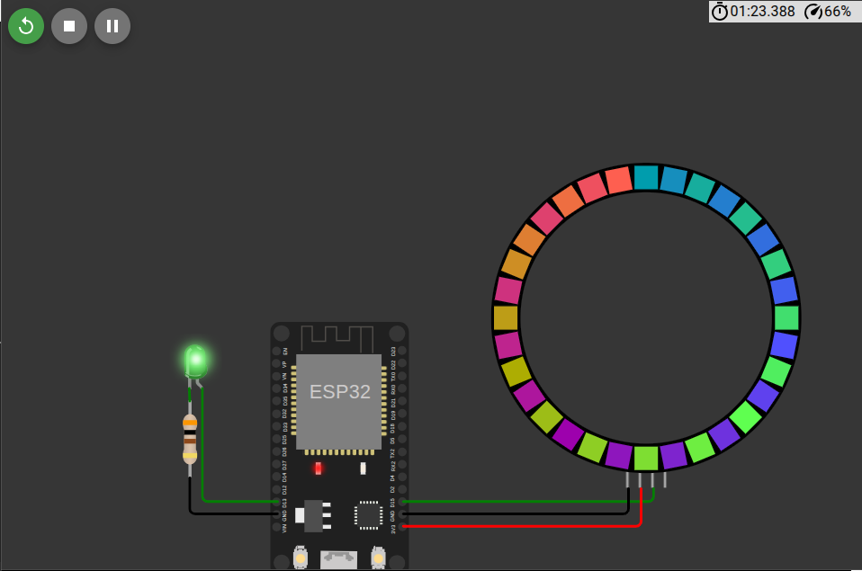

# BubbleSort Visualization

MicroPython script for a ESP32 microcontroler that visualizes a bubble sort algorithm on a NeoPixel LED strip (32 LEDs) while blinking an onboard LED.

## How it Works

1. Generates RGB colors for each LED based on position (creating a rainbow gradient)
2. Sorts the LEDs by their red component using **bubble sort** (lines 39-43)
3. Displays the sorted result on the NeoPixel strip
4. Repeats every 100ms with animation offset

## Hardware - everything was testet on WOWKI (microcontroler simulator)

- ESP32 microcontroler
- NeoPixel strip (32 LEDs) on GPIO 15
- Onboard LED on GPIO 13

## Screenshots

